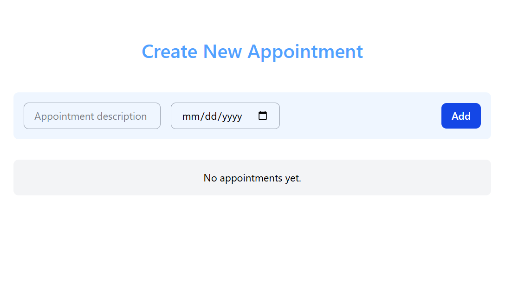

# 📅 Appointment App

A simple and responsive appointment management app built with **Angular 17** and **Tailwind CSS v4**.

## ✨ Features

- ➕ Add new appointments with description and date
- 📋 Display all saved appointments
- ❌ Delete appointments
- 💾 Persist data using **localStorage** (data stays after refresh)
- 📱 Fully responsive design

---

## 🛠️ Tech Stack

- **Angular 17**
- **Tailwind CSS v4**
- **TypeScript**
- **LocalStorage API**

---

## 🚀 Getting Started

1. Clone the repository

```bash
git clone https://github.com/nabdelfattah/appointment-app.git
cd appointment-app
```

2. Install dependencies

```bash
npm install
```

3. Run the app

```bash
ng serve
```

Then open your browser at: http://localhost:4200

## 📂 Project Structure

```
src/
 ├── app/
 │    ├── appointment-list/
 │    │    ├── appointment-list.component.ts
 │    │    ├── appointment-list.component.html
 │    │    └── appointment-list.component.css
 │    └── ...
 └── ...
```

## 🧠 How It Works

- User inputs:
  Appointment description
  Appointment date
- On submit:
  Data is stored in an array
  Saved to localStorage
- On app load:
  Data is retrieved from localStorage
  Each appointment has a unique ID for tracking and deletion

## 📸 Preview



## 📄 License

This project is open-source and available under the MIT License.
